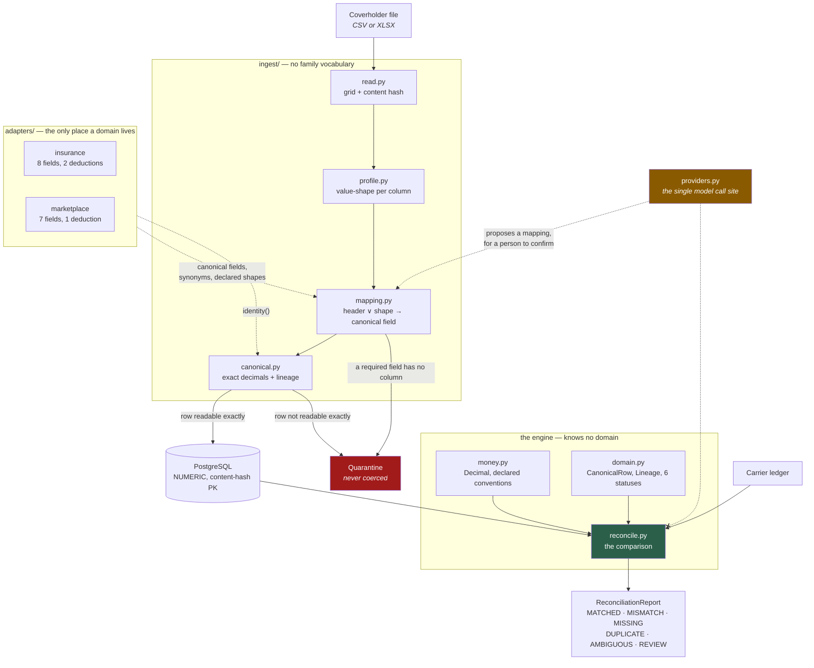
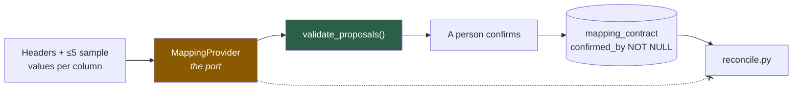
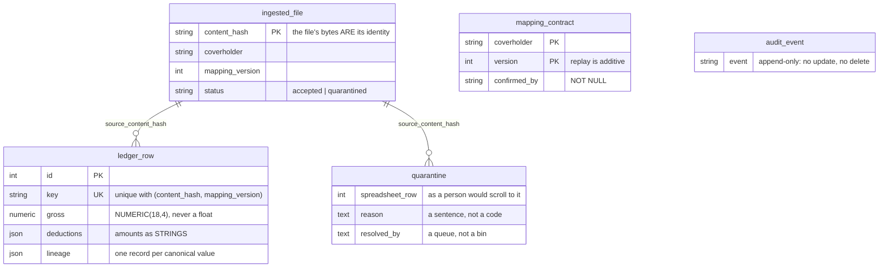
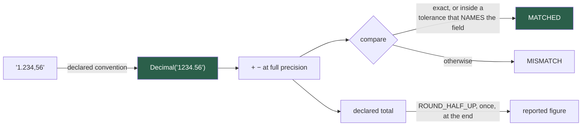
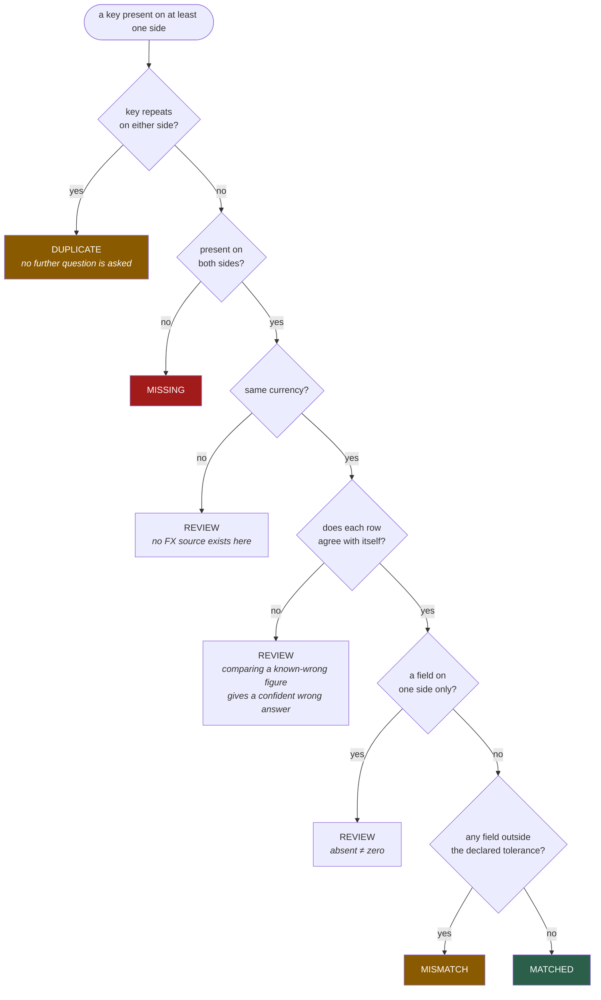
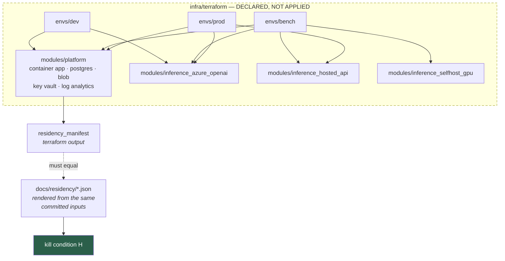

# Architecture

Four boundaries do most of the work here, and each exists to make a specific claim checkable rather
than merely stated.

---

## The pipeline

The dashed line from `providers.py` to `reconcile.py` is crossed out because it does not exist and
`test_providers.py` asserts it over the import graph. `reconcile.py` imports exactly two modules of
this package — `domain` and `money` — and neither knows what insurance is.

---

## Boundary 1 — the domain lives in an adapter pack

`reconcile.py`, `money.py`, `domain.py` and everything under `ingest/` contain no insurance
vocabulary. `gross_premium`, `commission` and `policy_reference` are names an adapter declares;
the engine sees roles (`GROSS`, `DEDUCTION`, `KEY`) and nothing else.

The falsifier is not "a second family also runs". It is a scan that parses every engine module,
drops its docstrings, and searches the identifiers and string literals of code it actually runs for
any registered family name or canonical field name. That scan caught two real leaks — a
`family="insurance"` default in a store helper, and `Literal["insurance", "marketplace"]` in the
domain model, which would have made a third adapter pack impossible to add without editing the
engine.

The marketplace pack is deliberately **not** a mirror of the insurance one: seven canonical fields
against eight, one deduction against two, a different identity function. A second adapter shaped
like the first would test nothing.

---

## Boundary 2 — the model proposes, and cannot do anything else

Three enforcement points, none of which is a convention:

| | mechanism | asserted by |
|---|---|---|
| A proposal cannot express money | `MappingProposal` has no numeric field | `test_providers.py`, over the model's own schema |
| A model cannot reach a status | no import path | `test_providers.py`, over the import graph |
| An invented field never reaches a human | `validate_proposals` runs first | `test_providers.py` |

A mapping is stored only with a person's name on it: `confirmed_by` is `NOT NULL` in the schema, so
a mapping that a model proposed and nobody accepted cannot exist in the table.

**PII minimisation is a property of the payload, not a promise.** `prompt_payload` is a separate
method precisely so a test can assert what would be sent: headers, at most five sample values per
column, the closed field set, and nothing else — no coverholder name, no totals.

---

## Boundary 3 — the guarantees are in the schema

Three decisions worth the space:

- **The content hash is the primary key of `ingested_file`.** A repeat ingestion is a constraint
  violation the database refuses, not a check the caller has to remember. A `SELECT` then `INSERT`
  would leave a window two workers can both pass through.
- **`ledger_row` is unique on (content hash, mapping version, key).** Replaying a period under a new
  mapping *inserts* rather than overwrites, so last month's numbers stay attributable to the mapping
  that produced them. Correcting history in place is how a reconciliation system loses the ability
  to explain what it said.
- **A file whose key repeats has those rows quarantined, not written.** The ledger is the accounting
  record and has to be unambiguous; the reconciliation report still reports them as `DUPLICATE`, so
  the row is visible — it simply is not yet money.

---

## Boundary 4 — what is exact, and what may round

Rounding happens in exactly two places, both declared in ADR-001: when parsing a source value to the
currency's minor unit, and once at the end when computing a declared total. Never per row — rounding
per row is how a total drifts a penny from its own detail and somebody loses an afternoon to it.

A tolerance is configuration. It names the fields it covers, a field it does not name requires exact
agreement whatever `absolute` says, and no model or heuristic can choose one.

---

## The reconciliation decision

**`MATCHED` is constructed at exactly one place in `reconcile.py`**, and `test_reconcile.py` asserts
that over the module's AST rather than trusting a reading of it. Kill condition D is a property of
the single guard in front of that statement; a second one would have to be guarded identically, and
nothing would make sure it was.

`REVIEW` is not a hedge. It is the engine saying a person must decide, and nothing is written to the
ledger while a row sits in it. A reconciler that must answer on every row answers wrongly on some,
and in this domain a wrong answer is money.

---

## The evaluation, and why the carrier ledger is synthesised

The corpus supplies one side. `evaluation/corpusio.py` builds the other from ground truth and then
**injects a declared set of discrepancies into it**:

| injection | must produce |
|---|---|
| gross out by one minor unit | `MISMATCH` |
| gross out materially | `MISMATCH` |
| a deduction changed while gross agrees to the penny | `MISMATCH` |
| a row absent from the carrier | `MISSING` |
| a row only in the carrier | `MISSING` |
| a carrier row whose own net no longer closes | `REVIEW` |

The first five keep the carrier's row internally consistent — moving a gross moves the net with it,
moving a deduction moves the net the other way — because an inconsistent row is one the reconciler
is right to refuse, so injecting one by accident would measure the arithmetic guard while appearing
to measure the comparison. The sixth breaks that consistency on purpose and expects exactly that
refusal.

Without the injections the carrier side would equal the truth, every row would legitimately be
`MATCHED`, and "zero false MATCHED" would be a statement about a test that could not fail.

---

## Deployment topology

Three environment roots composing one platform module, rather than CLI workspaces: the three
inference arms provision materially different things — an account and a deployment, nothing at all,
a GPU container app — and a single configuration serving all three would carry a conditional on
almost every resource.

`terraform validate` passes in all three roots against the real azurerm 5.6.0 schema. **Nothing has
been applied**, `terraform output` has never run, and what kill condition H actually proves is that
the committed manifest was rendered from the same committed inputs Terraform reads — so a region
changed in one place and not the other fails the build.
